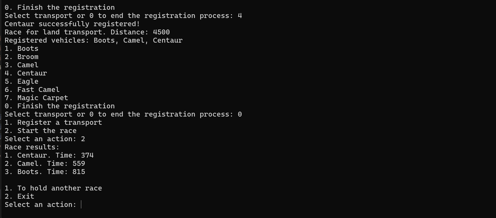

# Course project “Racing Simulator”
Course project - the simplest realization of a racing simulator for fantasy vehicles (TC).

## Content
### 1. Rules of the game
All TCs are divided into two types:

- ground;
- air.
There are several types of TCs in the simulator:

- camel (ground);
- fast camel (ground);
- centaur (ground);
- bogie-vehicle (ground);
- flying carpet (air);
- eagle;
- broom (aerial).
All vehicles have a predetermined speed.

There are several types of races in the simulator:

- for ground vehicles only;
- only for air vehicles;
- for ground and air vehicles.
#### Ground vehicles
Ground vehicles cannot move continuously: after a certain time they need to rest. Each type of land vehicle has its own travel time. The rest time is also different for each land vehicle and depends on the number of stops.

##### Example
The speed of the vehicle is 100 km/h, the distance is 1000 km, the driving time before rest is 6 hours, the rest duration is 3 hours. In this case, the vehicle will cover the distance in 1000 / 100 = 10 hours. Since the travel time before rest is equal to 6 hours, the vehicle will need to rest 1 time on the way. The total time will be: 10 + 3 = 13 h.

#### Air vehicles
Air vehicles move continuously. Since they can fly around obstacles, each air vehicle has its own distance reduction factor: that is, for each air vehicle, the distance to be traveled is reduced. The distance reduction factor can depend on the distance.

##### Example
If the air vehicle has a distance reduction factor of 5%, then instead of a distance of 1000 km, it needs to travel a distance of 1000 * 0.95 = 950 km.

### Screenshots

